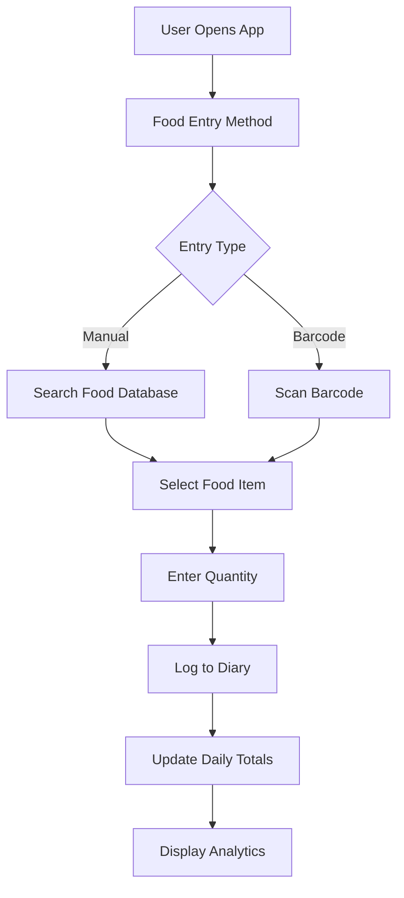
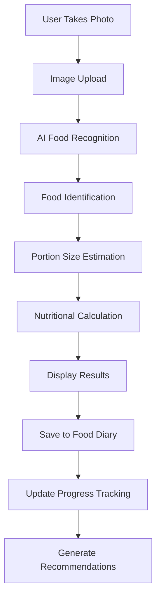
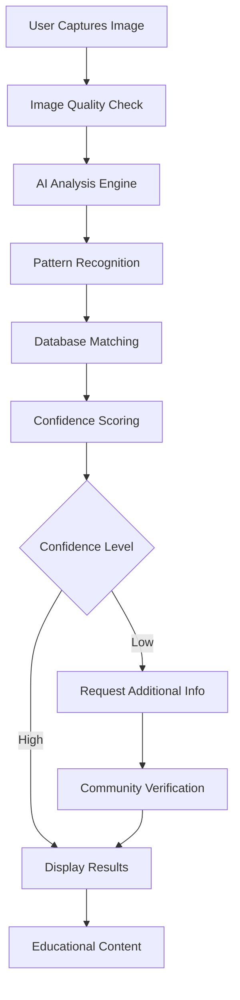
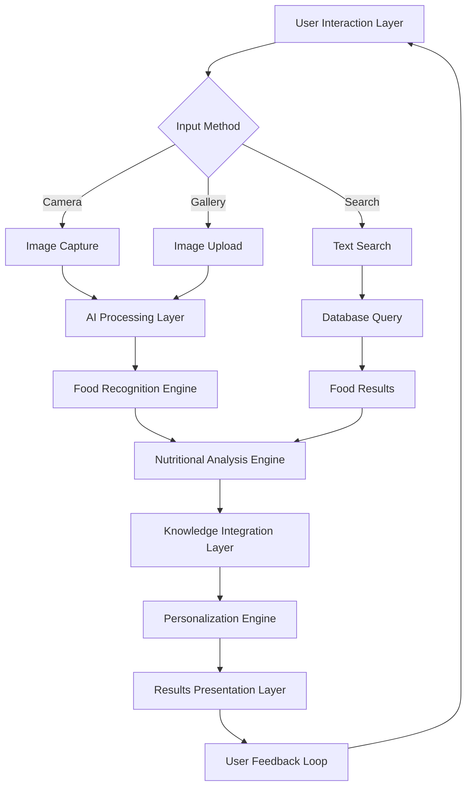
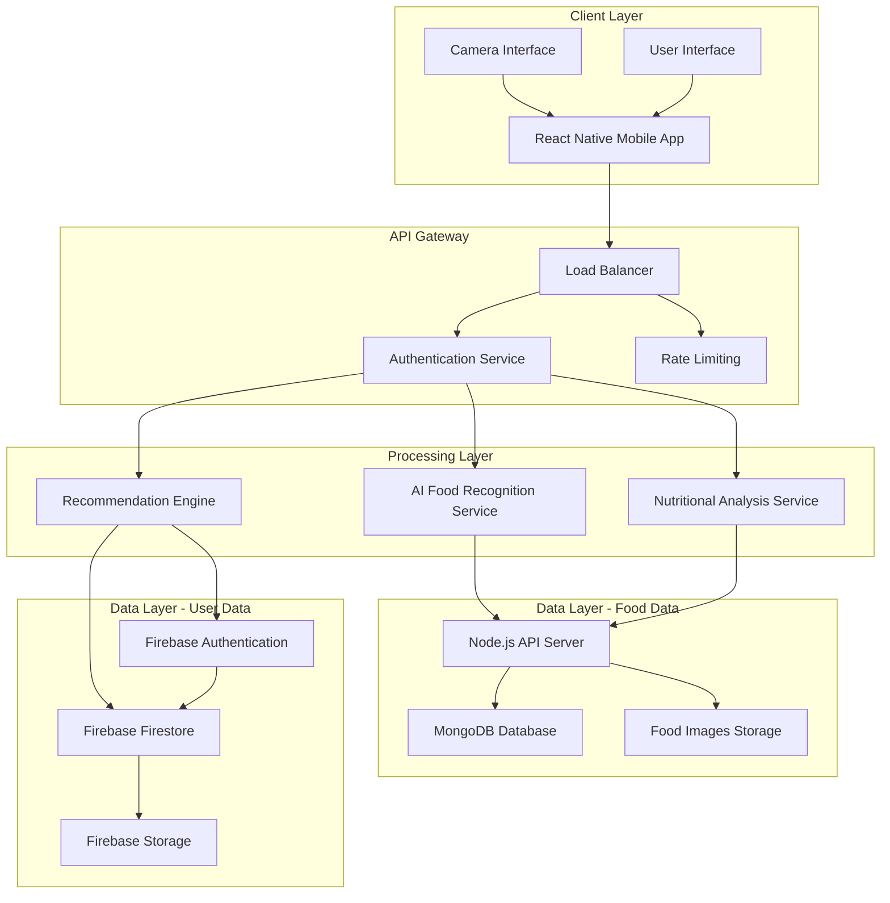
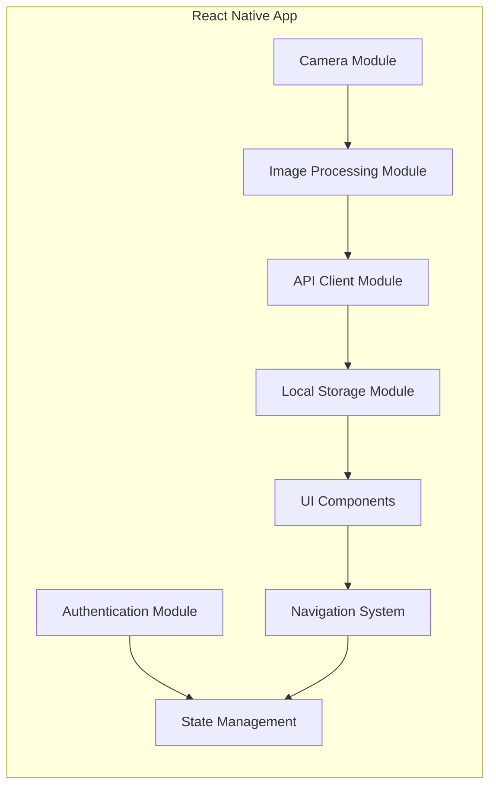
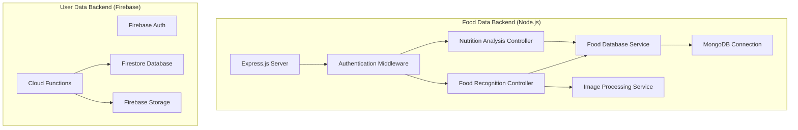
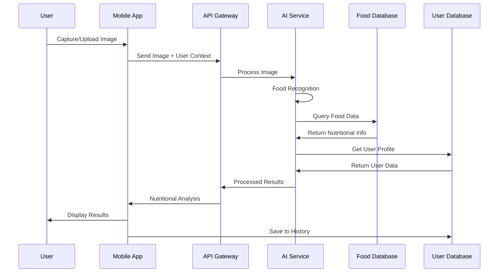

# CHAPTER 2: REVIEW OF RELATED WORKS / REVIEW OF SIMILAR SYSTEMS

## 2.1 Chapter Overview

This chapter provides a comprehensive review of existing food recognition and nutrition analysis systems, examining their features, strengths, and limitations. The analysis of these systems informs the design of the proposed NutriSense system, highlighting gaps in current solutions and opportunities for improvement. The chapter also presents the conceptual design and architecture of the proposed system, detailing its components and their interactions.

## 2.2 Processes of Existing Systems

### 2.2.1 MyFitnessPal - Nutritional Tracking System

**System Overview**
MyFitnessPal is one of the most popular nutrition tracking applications with over 200 million users worldwide. It primarily focuses on calorie counting and macronutrient tracking through manual food entry and barcode scanning.

**System Features**

- Extensive food database with over 14 million food items
- Barcode scanning for packaged foods
- Manual food entry with search functionality
- Calorie and macronutrient tracking
- Exercise logging and integration
- Social features and community support
- Premium subscription with advanced analytics

**Process Flow**



**Pros**

- Comprehensive food database covering international foods
- User-friendly interface with intuitive navigation
- Strong community support and social features
- Accurate calorie counting for weight management
- Integration with fitness trackers and health apps
- Offline functionality for basic features

**Cons**

- Lacks image-based food recognition capabilities
- Limited focus on African or traditional foods
- Manual entry process is time-consuming
- No digestive insights or health recommendations
- Premium features require subscription
- Accuracy depends on user input and food database quality

### 2.2.2 Foodvisor - AI-Powered Food Recognition System

**System Overview**
Foodvisor is an AI-powered nutrition app that uses computer vision to identify foods from photos and provide nutritional analysis. It targets users seeking convenient nutrition tracking through image recognition technology.

**System Features**

- AI-powered food recognition from photos
- Nutritional analysis and calorie estimation
- Portion size detection and analysis
- Meal planning and recipe suggestions
- Progress tracking and goal setting
- Nutritionist consultation services
- Personalized nutrition recommendations

**Process Flow**



**Pros**

- Advanced AI food recognition technology
- Automatic portion size estimation
- Quick and convenient food logging
- Professional nutritionist support
- Personalized recommendations based on goals
- Good accuracy for common Western foods

**Cons**

- Limited accuracy for traditional African foods
- Requires internet connectivity for AI processing
- Premium subscription required for full features
- No digestive timeline insights
- Limited educational content about food benefits
- Struggles with mixed dishes and complex meals

### 2.2.3 Plantnet - Plant and Food Identification System

**System Overview**
Plantnet is a collaborative project that uses AI to identify plants and foods from images. While primarily focused on plant identification, it has expanded to include food recognition capabilities for natural and traditional foods.

**System Features**

- Image-based plant and food identification
- Collaborative database with user contributions
- Educational content about plants and foods
- Geographic distribution mapping
- Multi-language support
- Open-source community contributions
- Scientific classification information

**Process Flow**



**Pros**

- Strong focus on natural and traditional foods
- Collaborative community approach
- Educational content about food origins
- Multi-language support including African languages
- Free and open-source platform
- Good accuracy for plant-based foods

**Cons**

- Limited nutritional analysis capabilities
- No calorie counting or macronutrient tracking
- Basic user interface and user experience
- Slow processing times for complex images
- Limited mobile app functionality
- No personalized recommendations or health insights

## 2.3 The Proposed System

### 2.3.1 System Overview

The proposed NutriSense system addresses the limitations of existing solutions by providing a comprehensive AI-powered food analysis platform specifically designed for Ghanaian and traditional African foods. The system combines advanced computer vision, nutritional science, and mobile technology to deliver real-time food recognition, nutritional analysis, and health insights.

### 2.3.2 Key Differentiators

**Cultural Relevance**

- Specialized focus on Ghanaian and West African traditional foods
- Culturally appropriate nutritional recommendations
- Integration of traditional food knowledge and modern nutrition science

**Comprehensive Analysis**

- Beyond calorie counting to include digestive insights and health benefits
- Personalized recommendations based on individual health profiles
- Educational content about food preparation and cultural significance

**Advanced Technology**

- Optimized MobileNetV2 model for mobile devices
- Dual backend architecture for optimal performance
- Real-time processing with offline capabilities

**User-Centric Design**

- Intuitive mobile interface designed for diverse user literacy levels
- Interactive chatbot for nutrition guidance
- Progressive web app capabilities for broader accessibility

## 2.4 Conceptual Design

### 2.4.1 System Concept

The NutriSense system operates on a multi-layered architecture that seamlessly integrates user interaction, AI processing, data management, and knowledge delivery. The conceptual design emphasizes user experience, accuracy, and cultural relevance while maintaining scalability and performance.

**Core Concept Flow**



### 2.4.2 Design Principles

**Accessibility First**

- Mobile-first design optimized for smartphones
- Offline capabilities for areas with limited connectivity
- Multi-language support starting with English and local languages

**Accuracy and Reliability**

- Continuous model improvement through user feedback
- Multiple validation layers for food identification
- Transparent confidence scoring for predictions

**Educational Focus**

- Rich educational content about food and nutrition
- Progressive disclosure of information based on user interest
- Integration of cultural food knowledge and modern nutrition science

**Privacy and Security**

- Local processing where possible to protect user privacy
- Secure data transmission and storage
- User control over data sharing and retention

## 2.5 Architecture of the Proposed System

### 2.5.1 High-Level System Architecture

The NutriSense system follows a distributed architecture pattern that separates concerns while maintaining tight integration between components. The architecture supports scalability, maintainability, and performance optimization.

**Overall System Architecture**



### 2.5.2 Detailed Component Architecture

**Mobile Application Layer**



**Backend Services Architecture**



### 2.5.3 Data Flow Architecture

**Image Processing and Recognition Flow**



## 2.6 Components Design and Components Descriptions

### 2.6.1 Mobile Application Components

**Authentication Component**
The authentication component manages user registration, login, and session management through Firebase Authentication. It supports email/password authentication with plans for social login integration.

_Functionality:_

- User registration with email verification
- Secure login with password validation
- Password reset and recovery
- Session management and token refresh
- User profile creation and management

**Camera Interface Component**
The camera interface provides multiple food input methods including real-time image capture and gallery selection, optimized for food photography. It includes image quality enhancement and guidance features.

_Functionality:_

- Real-time camera preview with focus assistance for live capture
- Gallery integration for selecting existing food photos
- Image quality assessment and guidance for both capture methods
- Multiple capture modes (single shot, burst mode)
- Image cropping and basic editing tools
- Seamless switching between camera and gallery modes

**Image Processing Component**
This component handles local image preprocessing, optimization, and preparation for AI analysis while maintaining image quality and reducing file size.

_Functionality:_

- Image compression and optimization
- Format standardization and conversion
- Quality enhancement filters
- Metadata extraction and processing
- Local caching and temporary storage

**Food Search Component**
This component enables users to find foods through text-based search functionality, supporting both English and local food names for comprehensive food discovery.

_Functionality:_

- Text-based food search with autocomplete suggestions
- Support for both English and local Ghanaian food names
- Fuzzy search algorithm for handling spelling variations
- Search history and favorite foods management
- Integration with food database for instant nutritional information
- Voice-to-text search capability for hands-free operation

### 2.6.2 AI Processing Components

**Food Recognition Engine**
The core AI component utilizing a fine-tuned MobileNetV2 model specifically trained on Ghanaian traditional foods with 74.90% accuracy.

_Algorithm Overview:_

```
1. Image Preprocessing
   - Resize to 224x224 pixels
   - Normalize pixel values
   - Apply data augmentation if needed

2. Feature Extraction
   - Pass through MobileNetV2 backbone
   - Extract high-level feature representations
   - Apply attention mechanisms for food-specific features

3. Classification
   - Dense layer processing with dropout
   - Softmax activation for probability distribution
   - Confidence scoring and threshold validation

4. Post-processing
   - Result validation against confidence thresholds
   - Multi-model ensemble if confidence is low
   - Fallback to user input for unrecognized foods
```

**Nutritional Analysis Engine**
This component processes recognized foods and calculates comprehensive nutritional information including macronutrients, micronutrients, and health insights.

_Processing Algorithm:_

```
1. Food Database Lookup
   - Query MongoDB for food nutritional data
   - Retrieve base nutritional values per 100g
   - Access preparation method variations

2. Portion Size Estimation
   - Analyze image for size references
   - Apply machine learning-based portion estimation
   - User confirmation and adjustment interface

3. Nutritional Calculation
   - Scale nutritional values based on estimated portion
   - Calculate calories, macronutrients, and micronutrients
   - Consider cooking method impacts on nutrition

4. Health Analysis
   - Cross-reference with user health profile
   - Generate personalized recommendations
   - Identify potential allergens or dietary restrictions
```

### 2.6.3 Backend Service Components

**Node.js API Server Component**
The primary backend service handling food-related data operations, AI model integration, and nutritional analysis processing.

_Core Services:_

- RESTful API endpoints for food operations
- AI model integration and inference
- Food database management and queries
- Image storage and retrieval services
- Caching mechanisms for performance optimization

**MongoDB Database Component**
The primary database storing comprehensive food information, nutritional data, and system metadata.

_Database Schema Design:_

```
Foods Collection:
{
  _id: ObjectId,
  name: String,
  local_name: String,
  category: String,
  nutritional_info: {
    calories_per_100g: Number,
    protein: Number,
    carbohydrates: Number,
    fats: Number,
    fiber: Number,
    vitamins: Object,
    minerals: Object
  },
  health_benefits: [String],
  digestive_info: {
    digestion_time: Number,
    ease_of_digestion: String
  },
  preparation_methods: [Object],
  cultural_significance: String,
  images: [String]
}
```

**Firebase Integration Component**
Manages user authentication, personal data storage, and real-time synchronization across devices.

_Firebase Services:_

- Authentication: User registration and login
- Firestore: User profiles, food history, preferences
- Cloud Storage: User-uploaded images and profile photos
- Cloud Functions: Serverless processing for user-specific operations

### 2.6.4 Integration and Communication Components

**API Gateway Component**
Manages external API calls, rate limiting, authentication verification, and load balancing between services.

_Features:_

- Request routing and load balancing
- Authentication token validation
- Rate limiting and abuse prevention
- Request/response logging and monitoring
- Error handling and retry mechanisms

**Real-time Synchronization Component**
Ensures data consistency across multiple devices and handles offline/online state management.

_Synchronization Strategy:_

- Local-first data storage with periodic sync
- Conflict resolution for concurrent edits
- Background synchronization when connectivity is restored
- Real-time updates for shared data

## 2.7 Proposed System/Software Features

### 2.7.1 Core Features

**AI-Powered Food Recognition**

- Real-time food identification through multiple input methods:
  - Camera capture for live food photography
  - Gallery upload for existing food images
  - Text-based search by food name or local name
- Support for traditional Ghanaian foods with 74.90% accuracy
- Confidence scoring and uncertainty handling
- Multiple food detection in single images

**Comprehensive Nutritional Analysis**

- Detailed macronutrient and micronutrient breakdown
- Calorie calculation with portion size estimation
- Vitamin and mineral content analysis
- Allergen identification and warnings

**Personalized Health Insights**

- Customized recommendations based on user health profile
- Daily nutritional goal tracking and progress monitoring
- Health condition-specific dietary suggestions
- Integration with user's age, gender, activity level, and health goals

**Digestive Timeline Insights**

- Food digestion duration estimates
- Optimal meal timing recommendations
- Digestive compatibility analysis for food combinations
- Personalized digestion patterns based on user feedback

### 2.7.2 Advanced Features

**Interactive Nutrition Chatbot**

- Natural language processing for nutrition queries
- Contextual responses based on user history and preferences
- Educational content delivery through conversational interface
- Integration with food recognition results for immediate guidance

**Food History and Progress Tracking**

- Comprehensive food diary with visual timeline
- Nutritional intake analysis over time
- Goal achievement tracking and celebrations
- Export capabilities for healthcare provider sharing

**Educational Food Library**

- Detailed information about traditional Ghanaian foods
- Cultural significance and traditional preparation methods
- Health benefits and medicinal properties
- Recipe suggestions and cooking tips

**Social and Community Features**

- Food discovery and sharing capabilities
- Community challenges and group goals
- Expert nutrition content and tips
- User-generated content moderation

### 2.7.3 Technical Features

**Offline Functionality**

- Local food recognition for basic foods when offline
- Cached nutritional data for previously scanned foods
- Offline food diary and history access
- Automatic synchronization when connectivity is restored

**Multi-platform Compatibility**

- Native iOS and Android applications
- Responsive web interface for broader accessibility
- Cross-platform data synchronization
- Consistent user experience across devices

**Accessibility Features**

- Voice guidance and audio feedback
- High contrast mode and large text options
- Screen reader compatibility
- Multi-language support starting with English and Twi

## 2.8 Development Tools and Environment

### 2.8.1 Frontend Development Tools

**React Native Framework**
React Native provides the foundation for cross-platform mobile development, enabling code reuse across iOS and Android platforms while maintaining native performance and user experience.

**Key Libraries and Dependencies:**

- Expo SDK for rapid development and testing
- React Navigation for seamless navigation experience
- React Native Camera for image capture functionality
- Async Storage for local data persistence
- React Native Vector Icons for consistent iconography

**Development Environment:**

- Node.js runtime environment
- Expo CLI for development workflow
- Android Studio for Android development and testing
- Xcode for iOS development and testing
- Visual Studio Code with React Native extensions

### 2.8.2 Backend Development Tools

**Node.js Runtime Environment**
Node.js provides the server-side JavaScript runtime for building scalable backend services with non-blocking I/O operations optimized for real-time applications.

**Express.js Framework**
Express.js serves as the web application framework for building RESTful APIs with middleware support for authentication, logging, and error handling.

**Database Technologies:**

- MongoDB for food data storage with flexible schema design
- Mongoose ODM for elegant MongoDB object modeling
- Firebase Firestore for real-time user data synchronization
- Firebase Authentication for secure user management

### 2.8.3 AI/ML Development Tools

**TensorFlow and Keras**
TensorFlow provides the machine learning framework for developing and training the food recognition model, with Keras offering high-level API for rapid prototyping.

**Model Development Tools:**

- Jupyter Notebooks for interactive model development
- Google Colab for cloud-based training with GPU acceleration
- TensorFlow Lite for mobile model optimization
- OpenCV for image preprocessing and computer vision tasks

**Data Management:**

- Python pandas for data manipulation and analysis
- NumPy for numerical computing and array operations
- Matplotlib and Seaborn for data visualization
- Scikit-learn for additional machine learning utilities

### 2.8.4 Development and Deployment Tools

**Version Control and Collaboration**

- Git for distributed version control
- GitHub for code repository hosting and collaboration
- GitHub Actions for continuous integration and deployment
- Conventional commits for standardized commit messages

**Testing and Quality Assurance**

- Jest for JavaScript unit testing
- Detox for end-to-end mobile testing
- ESLint for code quality and style enforcement
- Prettier for consistent code formatting

**Deployment and Hosting**

- Firebase Hosting for web application deployment
- App Store Connect and Google Play Console for mobile app distribution
- MongoDB Atlas for cloud database hosting
- Vercel or Netlify for static site hosting

## 2.9 Benefits of Implementation of the Proposed System

### 2.9.1 Individual User Benefits

**Enhanced Nutritional Awareness**
Users gain immediate access to comprehensive nutritional information about their food choices, enabling informed dietary decisions that can improve overall health and wellbeing.

**Time-Efficient Food Tracking**
The AI-powered recognition system eliminates the tedious process of manual food entry, making nutrition tracking accessible and sustainable for busy individuals.

**Personalized Health Guidance**
Customized recommendations based on individual health profiles help users optimize their diet for specific health goals, whether weight management, fitness, or medical conditions.

**Cultural Food Education**
Users learn about the nutritional value and health benefits of traditional foods, fostering appreciation for cultural cuisine while promoting healthy eating habits.

### 2.9.2 Healthcare System Benefits

**Preventive Healthcare Support**
By promoting better dietary choices, the system contributes to disease prevention, potentially reducing healthcare costs and improving population health outcomes.

**Clinical Decision Support**
Healthcare providers can access patient nutrition data to inform treatment decisions and provide evidence-based dietary counseling.

**Public Health Data Collection**
Aggregated, anonymized data can inform public health initiatives and nutrition policy development for better population health strategies.

**Healthcare Accessibility**
The system extends nutrition education and guidance to underserved populations who may not have regular access to nutrition professionals.

### 2.9.3 Societal and Economic Benefits

**Cultural Preservation**
Digital documentation of traditional foods and their nutritional properties helps preserve cultural knowledge for future generations.

**Economic Opportunities**
The system creates opportunities for local food producers and vendors by increasing awareness of traditional foods' nutritional value.

**Research Advancement**
The platform provides a foundation for nutrition research specific to African foods, filling gaps in scientific literature.

**Technology Transfer**
The project demonstrates successful application of AI technology for social good, providing a model for similar initiatives in other regions.

### 2.9.4 Educational Benefits

**Nutrition Literacy Improvement**
The system serves as an educational tool that improves nutrition literacy across diverse populations, from students to adults.

**Academic Research Platform**
The system provides researchers with tools and data for studying nutrition patterns, food preferences, and health outcomes in African populations.

**Professional Development**
Healthcare professionals, nutritionists, and educators can use the system to enhance their practice and stay updated on traditional food nutrition.

**Community Engagement**
The platform fosters community discussions about food, nutrition, and health, creating networks of support for healthy lifestyle changes.

---

_This chapter has examined existing nutrition and food recognition systems, identifying their strengths and limitations. The proposed NutriSense system addresses these gaps through culturally relevant AI-powered food analysis, comprehensive nutritional insights, and user-centric design. The following chapter will detail the methodology and technical approach for implementing this innovative system._
