# CHAPTER 3: METHODOLOGY

## 3.1 Chapter Overview

This chapter presents the comprehensive methodology employed in the development of the NutriSense system. It covers the requirement specification process, stakeholder analysis, functional and non-functional requirements, UML diagrams, security concepts, project management approaches, and design considerations. The methodology follows industry best practices and academic standards to ensure systematic development and delivery of a robust, scalable, and user-centered food analysis system.

## 3.2 Requirement Specification

### 3.2.1 Requirements Engineering Process

The requirement specification process for NutriSense follows a structured approach incorporating multiple requirement gathering techniques to ensure comprehensive coverage of user needs, system capabilities, and technical constraints.

**Requirements Engineering Lifecycle:**


**Requirements Sources:**

- Literature review of existing nutrition and food recognition systems
- User interviews and surveys with potential system users
- Expert consultations with nutritionists and health professionals
- Technical analysis of AI and mobile development capabilities
- Regulatory and compliance requirements for health applications

### 3.2.2 Requirements Classification Framework

Requirements are classified using the MoSCoW prioritization method to ensure focused development and resource allocation:

- **Must Have**: Critical requirements for system viability
- **Should Have**: Important requirements for system completeness
- **Could Have**: Desirable features that enhance user experience
- **Won't Have**: Features excluded from current scope

## 3.3 Stakeholders of System

### 3.3.1 Primary Stakeholders

**End Users - General Public**

- **Role**: Primary system users seeking nutritional information
- **Needs**: Easy-to-use interface, accurate food recognition, reliable nutritional data
- **Expectations**: Fast response times, offline functionality, cultural relevance
- **Impact**: High - Direct users whose satisfaction determines system success

**Health-Conscious Individuals**

- **Role**: Users with specific dietary goals and health objectives
- **Needs**: Detailed nutritional tracking, personalized recommendations, progress monitoring
- **Expectations**: Advanced analytics, goal setting, integration with fitness apps
- **Impact**: High - Key user segment driving feature requirements

**Healthcare Professionals**

- **Role**: Nutritionists, dietitians, and medical practitioners
- **Needs**: Clinical-grade accuracy, patient data access, evidence-based recommendations
- **Expectations**: Professional credibility, data export capabilities, regulatory compliance
- **Impact**: Medium - Influential in system credibility and adoption

### 3.3.2 Secondary Stakeholders

**Development Team**

- **Role**: Software developers, AI engineers, UI/UX designers
- **Needs**: Clear requirements, technical feasibility, development tools
- **Expectations**: Realistic timelines, adequate resources, technical support
- **Impact**: High - Responsible for system implementation and quality

**Academic Institution**

- **Role**: University providing educational context and evaluation framework
- **Needs**: Academic rigor, research contribution, learning outcomes
- **Expectations**: Documentation quality, technical innovation, knowledge transfer
- **Impact**: Medium - Provides academic validation and assessment

**Cultural and Nutrition Experts**

- **Role**: Traditional food specialists and nutrition researchers
- **Needs**: Accurate cultural representation, scientific validity, knowledge preservation
- **Expectations**: Cultural sensitivity, traditional knowledge integration
- **Impact**: Medium - Ensures cultural appropriateness and scientific accuracy

### 3.3.3 Stakeholder Analysis Matrix


## 3.4 Requirement Gathering Process

### 3.4.1 Data Collection Methods

**User Interviews**
Conducted structured interviews with 25 potential users from diverse backgrounds to understand their nutrition tracking habits, challenges, and expectations.

_Interview Framework:_

- Current nutrition awareness practices
- Technology usage patterns and preferences
- Cultural food knowledge and dietary habits
- Challenges with existing nutrition apps
- Desired features and functionality

**Expert Consultations**
Engaged with nutrition professionals, traditional food experts, and AI researchers to validate technical approaches and ensure scientific accuracy.

_Consultation Areas:_

- Nutritional data accuracy and sources
- Traditional food preparation impact on nutrition
- AI model requirements and limitations
- User interface design for diverse literacy levels

**Market Research**
Analyzed existing solutions to identify gaps, opportunities, and best practices in food recognition and nutrition tracking applications.

_Analysis Framework:_

- Feature comparison and gap analysis
- User feedback and review analysis
- Technical architecture evaluation
- Pricing and accessibility assessment

### 3.4.2 Requirements Validation Process

**Stakeholder Review Cycles**
Conducted iterative review sessions with key stakeholders to validate and refine requirements based on feedback and changing needs.

**Prototype Validation**
Developed low-fidelity prototypes to validate user interface requirements and gather early feedback on core functionality.

**Technical Feasibility Assessment**
Evaluated technical requirements against available resources, technologies, and constraints to ensure realistic implementation scope.

## 3.5 Functional Requirements

### 3.5.1 Core Functional Requirements

**FR-001: User Authentication and Profile Management**

- **Priority**: Must Have
- **Description**: System shall provide secure user registration, authentication, and profile management
- **Acceptance Criteria**:
  - Users can register with email and password
  - Email verification required for account activation
  - Secure login with session management
  - Password reset functionality available
  - User profile creation with health information

**FR-002: Food Recognition via Camera**

- **Priority**: Must Have
- **Description**: System shall identify foods from camera-captured images using AI
- **Acceptance Criteria**:
  - Real-time camera interface for food photography
  - AI model achieves minimum 70% accuracy for Ghanaian foods
  - Processing time under 5 seconds for local foods
  - Confidence scoring for recognition results
  - Fallback option for unrecognized foods

**FR-003: Food Recognition via Gallery Upload**

- **Priority**: Must Have
- **Description**: System shall identify foods from user-selected gallery images
- **Acceptance Criteria**:
  - Gallery integration for image selection
  - Support for common image formats (JPEG, PNG)
  - Image optimization for AI processing
  - Same accuracy standards as camera capture
  - Metadata preservation for analysis improvement

**FR-004: Text-Based Food Search**

- **Priority**: Must Have
- **Description**: System shall provide comprehensive text search for foods by name
- **Acceptance Criteria**:
  - Search supports English and local food names
  - Autocomplete suggestions during typing
  - Fuzzy search for spelling variations
  - Search results ranked by relevance
  - Search history and favorites management

**FR-005: Nutritional Analysis and Display**

- **Priority**: Must Have
- **Description**: System shall provide detailed nutritional information for identified foods
- **Acceptance Criteria**:
  - Comprehensive macronutrient breakdown
  - Micronutrient information where available
  - Calorie calculation with portion size estimation
  - Visual presentation of nutritional data
  - Comparison with daily recommended values

### 3.5.2 Advanced Functional Requirements

**FR-006: Personalized Health Recommendations**

- **Priority**: Should Have
- **Description**: System shall generate personalized nutrition recommendations based on user profile
- **Acceptance Criteria**:
  - Recommendations based on age, gender, activity level
  - Integration with user's health goals
  - Dietary restriction considerations
  - Daily nutrition target tracking
  - Progress monitoring and feedback

**FR-007: Food History and Tracking**

- **Priority**: Should Have
- **Description**: System shall maintain comprehensive food consumption history
- **Acceptance Criteria**:
  - Chronological food diary with timestamps
  - Daily, weekly, monthly nutrition summaries
  - Visual charts and progress indicators
  - Export functionality for external use
  - Data synchronization across devices

**FR-008: Interactive Nutrition Chatbot**

- **Priority**: Could Have
- **Description**: System shall provide conversational interface for nutrition queries
- **Acceptance Criteria**:
  - Natural language understanding for food questions
  - Contextual responses based on user history
  - Educational content delivery
  - Integration with food recognition results
  - Multi-language support capabilities

**FR-009: Educational Food Library**

- **Priority**: Should Have
- **Description**: System shall provide comprehensive information about traditional foods
- **Acceptance Criteria**:
  - Detailed food profiles with cultural significance
  - Health benefits and medicinal properties
  - Preparation methods and cooking tips
  - Visual content and recipe suggestions
  - Search and categorization functionality

**FR-010: Offline Functionality**

- **Priority**: Should Have
- **Description**: System shall provide core functionality without internet connectivity
- **Acceptance Criteria**:
  - Offline food recognition for cached foods
  - Local storage of user data and history
  - Background synchronization when online
  - Offline access to previously viewed food information
  - Clear indication of online/offline status

## 3.6 UML Diagrams

### 3.6.1 Use Case Diagrams

**Frontend Use Case Diagram**


**Backend Use Case Diagram**


### 3.6.2 Use Case Descriptions

**UC3: Capture Food Image**

- **Actor**: User (Guest/Registered)
- **Precondition**: User has camera access permissions
- **Main Flow**:
  1. User opens camera interface
  2. System activates camera with food capture guidance
  3. User positions food item and captures image
  4. System validates image quality
  5. System processes image through AI recognition
  6. System displays recognition results with confidence score
  7. User confirms or corrects food identification
- **Alternative Flow**:
  - 4a. If image quality is poor, system provides guidance and requests recapture
  - 6a. If confidence is low, system suggests alternative foods or manual entry
- **Postcondition**: Food is identified and nutritional analysis is displayed

**UC5: Search Food by Name**

- **Actor**: User (Guest/Registered)
- **Precondition**: User has access to food database
- **Main Flow**:
  1. User enters food name in search interface
  2. System provides autocomplete suggestions
  3. User selects food from suggestions or completes typing
  4. System queries food database for matches
  5. System displays search results with images and basic info
  6. User selects desired food item
  7. System displays detailed nutritional information
- **Alternative Flow**:
  - 4a. If no matches found, system suggests similar foods or spelling corrections
  - 5a. If multiple exact matches, system displays disambiguation options
- **Postcondition**: Selected food's nutritional information is displayed

**UC10: Get Recommendations**

- **Actor**: Registered User
- **Precondition**: User has completed health profile and has food history
- **Main Flow**:
  1. User requests personalized recommendations
  2. System analyzes user's health profile and dietary goals
  3. System reviews recent food history and nutritional patterns
  4. System generates personalized recommendations
  5. System displays recommendations with explanations
  6. User can save or act on recommendations
- **Alternative Flow**:
  - 2a. If profile incomplete, system prompts for missing information
  - 4a. If insufficient history, system provides general recommendations
- **Postcondition**: Personalized recommendations are displayed and optionally saved

### 3.6.3 Activity Diagrams

**Food Recognition Process Activity Diagram**


**User Registration Activity Diagram**


### 3.6.4 Sequence Diagrams

**Food Recognition Sequence Diagram**


**User Authentication Sequence Diagram**


### 3.6.5 Class Diagrams

**Core System Class Diagram**

```mermaid
classDiagram
    class User {
        +String userId
        +String email
        +String firstName
        +String lastName
        +Date createdAt
        +HealthProfile healthProfile
        +List~FoodEntry~ foodHistory
        +login(email, password)
        +register(userData)
        +updateProfile(profileData)
        +getFoodHistory()
    }

    class HealthProfile {
        +int age
        +String gender
        +float height
        +float weight
        +String activityLevel
        +int dailyCalories
        +float dailyProtein
        +float dailyCarbs
        +float dailyFat
        +calculateNutritionNeeds()
        +updateHealthMetrics()
    }

    class Food {
        +String foodId
        +String name
        +String localName
        +String category
        +NutritionInfo nutritionInfo
        +List~String~ healthBenefits
        +DigestiveInfo digestiveInfo
        +String culturalSignificance
        +List~String~ images
        +getNutritionalValue()
        +getHealthBenefits()
    }

    class NutritionInfo {
        +float caloriesPer100g
        +float protein
        +float carbohydrates
        +float fats
        +float fiber
        +Map vitamins
        +Map minerals
        +calculateForPortion(portion)
    }

    class FoodEntry {
        +String entryId
        +String userId
        +String foodId
        +float portionSize
        +Date timestamp
        +String recognitionMethod
        +float confidence
        +NutritionSummary nutritionSummary
        +calculateNutrition()
    }

    class AIFoodRecognition {
        +String modelVersion
        +float accuracyThreshold
        +recognizeFood(image)
        +validateConfidence(result)
        +getAlternatives(image)
    }

    class FoodDatabase {
        +searchByName(name)
        +getFoodById(id)
        +getAllFoods()
        +addFood(food)
        +updateFood(food)
    }

    User ||--|| HealthProfile
    User ||--o{ FoodEntry
    FoodEntry ||--|| Food
    Food ||--|| NutritionInfo
    AIFoodRecognition ..> Food
    FoodDatabase ..> Food
```

**Mobile Application Class Diagram**


## 3.7 Non-Functional Requirements

### 3.7.1 Performance Requirements

**NFR-001: Response Time**

- **Requirement**: Food recognition processing shall complete within 5 seconds
- **Measurement**: Time from image capture/upload to result display
- **Justification**: User experience requires immediate feedback for mobile applications
- **Testing Method**: Performance testing with various image sizes and network conditions

**NFR-002: Throughput**

- **Requirement**: System shall handle 1000 concurrent users during peak usage
- **Measurement**: Successful request processing under load
- **Justification**: Scalability for growing user base
- **Testing Method**: Load testing with simulated concurrent users

**NFR-003: Model Accuracy**

- **Requirement**: AI food recognition shall achieve minimum 70% accuracy for target foods
- **Measurement**: Percentage of correctly identified foods in test dataset
- **Justification**: Accuracy threshold for practical utility and user trust
- **Testing Method**: Validation against curated test dataset with expert verification

### 3.7.2 Usability Requirements

**NFR-004: User Interface Responsiveness**

- **Requirement**: All user interactions shall provide feedback within 200ms
- **Measurement**: Time from user action to visual response
- **Justification**: Modern mobile application standards for perceived performance
- **Testing Method**: UI testing with automated interaction measurement

**NFR-005: Accessibility Compliance**

- **Requirement**: Application shall meet WCAG 2.1 AA accessibility standards
- **Measurement**: Compliance with accessibility guidelines
- **Justification**: Inclusive design for users with disabilities
- **Testing Method**: Accessibility audit and screen reader testing

**NFR-006: Multi-language Support**

- **Requirement**: System shall support English and local Ghanaian languages
- **Measurement**: Complete translation coverage for core features
- **Justification**: Cultural relevance and broader user accessibility
- **Testing Method**: Localization testing with native speakers

### 3.7.3 Reliability Requirements

**NFR-007: System Availability**

- **Requirement**: System shall maintain 99.5% uptime during operational hours
- **Measurement**: Percentage of time system is accessible and functional
- **Justification**: User dependence on nutrition tracking requires high availability
- **Testing Method**: Continuous monitoring and uptime measurement

**NFR-008: Data Integrity**

- **Requirement**: User data shall maintain 100% accuracy with no data loss
- **Measurement**: Data consistency checks and backup verification
- **Justification**: Health data accuracy is critical for user safety
- **Testing Method**: Data validation testing and backup recovery testing

**NFR-009: Offline Functionality**

- **Requirement**: Core features shall remain functional without internet connectivity
- **Measurement**: Feature availability in offline mode
- **Justification**: Users in areas with limited connectivity need access
- **Testing Method**: Offline testing scenarios with network disconnection

### 3.7.4 Security Requirements

**NFR-010: Data Encryption**

- **Requirement**: All user data shall be encrypted in transit and at rest
- **Measurement**: Implementation of encryption protocols
- **Justification**: Health data privacy and regulatory compliance
- **Testing Method**: Security audit and penetration testing

**NFR-011: Authentication Security**

- **Requirement**: User authentication shall implement multi-factor security measures
- **Measurement**: Security protocol implementation and vulnerability assessment
- **Justification**: Protection of personal health information
- **Testing Method**: Security testing and vulnerability scanning

## 3.8 Security Concepts

### 3.8.1 Security Architecture

The NutriSense system implements a multi-layered security architecture to protect user data, ensure system integrity, and maintain compliance with health data privacy regulations.

**Security Architecture Overview:**


### 3.8.2 Authentication and Authorization

**Firebase Authentication Integration**

- Secure user authentication using Firebase Auth service
- Email/password authentication with strong password requirements
- Session management with automatic token refresh
- Multi-device session control and remote logout capability

**Access Control Implementation**

- Role-based access control for different user types
- API endpoint protection with token validation
- Resource-level permissions for user data access
- Administrative access controls for system management

### 3.8.3 Data Protection Measures

**Encryption Standards**

- AES-256 encryption for data at rest
- TLS 1.3 for data in transit
- End-to-end encryption for sensitive health data
- Encrypted backup storage with secure key management

**Privacy Protection**

- Data minimization principles in collection and storage
- User consent management for data usage
- Anonymous data aggregation for analytics
- Right to data deletion and export compliance

**Secure Development Practices**

- Input validation and sanitization for all user inputs
- SQL injection prevention through parameterized queries
- XSS protection through output encoding
- Regular security updates and dependency management

### 3.8.4 Compliance and Regulatory Considerations

**Health Data Privacy**

- Compliance with applicable health data protection regulations
- User consent for health information collection and processing
- Secure handling of personally identifiable information (PII)
- Data retention policies aligned with regulatory requirements

**Security Monitoring**

- Real-time security event monitoring and alerting
- Audit logging for all data access and modifications
- Regular security assessments and vulnerability scanning
- Incident response procedures for security breaches

## 3.9 Project Methods (Agile or Plan-Driven)

### 3.9.1 Software Process Models Overview

**Waterfall Model**
The traditional waterfall model follows a linear, sequential approach where each phase must be completed before the next begins. While providing clear structure and documentation, it lacks flexibility for changing requirements.

_Advantages:_ Clear milestones, comprehensive documentation, predictable timeline
_Disadvantages:_ Inflexible to changes, late testing, risk of requirement misalignment

**Spiral Model**
The spiral model combines iterative development with systematic risk assessment, making it suitable for complex projects with uncertain requirements.

_Advantages:_ Risk management focus, iterative refinement, early prototyping
_Disadvantages:_ Complex management, expensive, requires risk assessment expertise

**Incremental Model**
The incremental model delivers working software in small, manageable increments, allowing for early user feedback and gradual system building.

_Advantages:_ Early delivery, user feedback integration, reduced risk
_Disadvantages:_ Requires careful planning, potential integration challenges

**Agile Methodologies**
Agile approaches emphasize iterative development, collaboration, and adaptability to changing requirements through short development cycles and continuous feedback.

_Advantages:_ Flexibility, user involvement, rapid delivery, quality focus
_Disadvantages:_ Requires experienced team, less predictable timeline, documentation challenges

### 3.9.2 Chosen Model and Justification

**Selected Approach: Modified Agile (Scrum-based) with Waterfall Elements**

The NutriSense project adopts a hybrid approach combining Agile Scrum methodology with selected Waterfall elements to balance flexibility with academic requirements and project constraints.

**Agile Components:**

- 2-week sprint cycles for iterative development
- Daily standups for team communication
- Sprint planning and retrospectives
- Continuous integration and testing
- User story-driven development

**Waterfall Components:**

- Comprehensive requirement documentation (academic requirement)
- Formal design phase with UML diagrams
- Structured testing phases
- Final documentation and presentation preparation

**Justification for Hybrid Approach:**

_Academic Requirements Alignment:_

- Structured documentation required for academic evaluation
- Clear milestone demonstration for progress assessment
- Comprehensive testing and validation requirements
- Final presentation and defense preparation

_Technical Project Needs:_

- AI model development requires iterative training and validation
- Mobile app development benefits from rapid prototyping
- User feedback integration essential for usability
- Cross-platform testing requires systematic approach

_Resource and Time Constraints:_

- Limited development team (primarily individual project)
- Fixed academic timeline with specific deliverable dates
- Need for flexibility within structured framework
- Balanced risk management approach

**Sprint Planning Framework:**


## 3.10 Project Design Considerations (Logical Designs)

### 3.10.1 UI Design (Wireframes)

**Mobile Application Wireframe Structure**

_Authentication Screens:_

```
+------------------+    +------------------+    +------------------+
|     Welcome      |    |     Login        |    |    Register      |
|                  |    |                  |    |                  |
|  [App Logo]      |    | Email: ______    |    | Email: ______    |
|                  |    | Pass:  ______    |    | Pass:  ______    |
| [Get Started]    |    |                  |    | Confirm: ____    |
| [Login]          |    | [Login] [Forgot] |    |                  |
|                  |    |                  |    | [Register]       |
+------------------+    +------------------+    +------------------+
```

_Main Application Screens:_

```
+------------------+    +------------------+    +------------------+
|    Dashboard     |    |   Food Scan      |    |   Search Food    |
|                  |    |                  |    |                  |
| Daily Progress   |    | +-------------+  |    | Search: ______   |
| [Nutrition Ring] |    | |   Camera    |  |    |                  |
|                  |    | |   Preview   |  |    | Recent Searches  |
| Quick Actions    |    | +-------------+  |    | - Banku          |
| [Scan] [Search]  |    |                  |    | - Waakye         |
| [History]        |    | [Capture][Gallery]   | - Fufu           |
|                  |    |                  |    |                  |
+------------------+    +------------------+    +------------------+
```

_Results and History Screens:_

```
+------------------+    +------------------+    +------------------+
|   Food Results   |    |   Food History   |    |  Food Details    |
|                  |    |                  |    |                  |
| [Food Image]     |    | Today            |    | [Food Image]     |
| Food Name        |    | +------+------+  |    | Banku            |
| Confidence: 89%  |    | |Banku | 250  |  |    |                  |
|                  |    | |cal   | cal  |  |    | Nutritional Info |
| Nutrition Info   |    | +------+------+  |    | Calories: 250    |
| Calories: 250    |    |                  |    | Protein: 5g      |
| Protein: 5g      |    | Yesterday        |    | Carbs: 50g       |
| Carbs: 50g       |    | +------+------+  |    | Fat: 2g          |
|                  |    | |Waakye| Rice |  |    |                  |
| [Save] [Share]   |    | |400cal| 300c |  |    | [Add to History] |
+------------------+    +------------------+    +------------------+
```

**Design Principles:**

_Accessibility-First Design:_

- High contrast colors for readability
- Large touch targets (minimum 44px)
- Clear typography with sufficient font sizes
- Voice-over support for screen readers
- Simple navigation structure

_Cultural Sensitivity:_

- Local food names prominently displayed
- Cultural context in food descriptions
- Traditional color schemes where appropriate
- Multi-language support considerations

_Mobile-First Approach:_

- Thumb-friendly navigation
- Minimal data usage design
- Offline-first content strategy
- Battery-efficient interface design

### 3.10.2 Database Design

**Entity-Relationship Diagram**

```mermaid
erDiagram
    USER {
        string user_id PK
        string email UK
        string first_name
        string last_name
        string password_hash
        datetime created_at
        datetime updated_at
        boolean email_verified
    }

    HEALTH_PROFILE {
        string profile_id PK
        string user_id FK
        int age
        string gender
        float height
        float weight
        string activity_level
        int daily_calories
        float daily_protein
        float daily_carbs
        float daily_fat
        datetime created_at
        datetime updated_at
    }

    FOOD {
        string food_id PK
        string name
        string local_name
        string category
        float calories_per_100g
        float protein_per_100g
        float carbs_per_100g
        float fat_per_100g
        text health_benefits
        int digestion_time
        string ease_of_digestion
        text cultural_significance
        json images
        datetime created_at
        datetime updated_at
    }

    FOOD_ENTRY {
        string entry_id PK
        string user_id FK
        string food_id FK
        float portion_size
        float calculated_calories
        float calculated_protein
        float calculated_carbs
        float calculated_fat
        string recognition_method
        float confidence_score
        datetime consumed_at
        datetime created_at
    }

    FOOD_SEARCH_HISTORY {
        string search_id PK
        string user_id FK
        string search_query
        string selected_food_id FK
        datetime searched_at
    }

    USER_GOALS {
        string goal_id PK
        string user_id FK
        string goal_type
        float target_value
        float current_value
        datetime start_date
        datetime target_date
        boolean active
    }

    USER ||--|| HEALTH_PROFILE : has
    USER ||--o{ FOOD_ENTRY : logs
    USER ||--o{ FOOD_SEARCH_HISTORY : searches
    USER ||--o{ USER_GOALS : sets
    FOOD ||--o{ FOOD_ENTRY : appears_in
    FOOD ||--o{ FOOD_SEARCH_HISTORY : found_in
```



**Database Schema Design Considerations**

_MongoDB Food Database Schema:_

```javascript
// Foods Collection
{
  "_id": ObjectId,
  "name": "Banku",
  "local_name": "Banku",
  "category": "Traditional Staple",
  "nutritional_info": {
    "calories_per_100g": 112,
    "protein": 2.1,
    "carbohydrates": 24.5,
    "fats": 0.3
  },
  "health_benefits": [
    "Good source of energy",
    "Contains beneficial probiotics",
    "Easy to digest"
  ],
  "digestive_info": {
    "digestion_time": 180,
    "ease_of_digestion": "Easy",
    "digestive_notes": "Fermented corn promotes gut health"
  },
  "preparation_methods": [
    {
      "method": "Traditional",
      "ingredients": ["corn dough", "cassava dough"],
      "nutritional_impact": "Standard values"
    }
  ],
  "cultural_significance": "Traditional Ga and Ewe staple food",
  "images": [
    "banku_traditional.jpg",
    "banku_with_soup.jpg"
  ],
  "created_at": ISODate(),
  "updated_at": ISODate()
}
```

_Firebase User Data Schema:_

```javascript
// Users Collection (Firestore)
{
  "uid": "unique_user_id",
  "profile": {
    "firstName": "John",
    "lastName": "Doe",
    "email": "john@example.com",
    "profileImage": "profile_url",
    "createdAt": Timestamp,
    "updatedAt": Timestamp
  },
  "health": {
    "age": 25,
    "gender": "male",
    "height": 175,
    "weight": 70,
    "activityLevel": "moderately_active",
    "dailyCalories": 2500,
    "dailyProtein": 125,
    "dailyCarbs": 312,
    "dailyFat": 83
  },
  "preferences": {
    "language": "en",
    "units": "metric",
    "notifications": true
  }
}

// Food Entries Subcollection
{
  "entryId": "unique_entry_id",
  "foodId": "food_reference_id",
  "portionSize": 150,
  "nutritionSummary": {
    "calories": 168,
    "protein": 3.2,
    "carbs": 36.8,
    "fat": 0.5
  },
  "recognitionMethod": "camera",
  "confidence": 0.89,
  "timestamp": Timestamp,
  "notes": "Lunch with pepper soup"
}
```

### 3.10.3 Developmental Tools

**Frontend Development Environment**

_React Native Development Stack:_

- **React Native CLI**: Project creation and management
- **Expo SDK**: Rapid development and testing framework
- **Metro Bundler**: JavaScript bundling and hot reloading
- **Flipper**: Debugging and performance monitoring
- **React DevTools**: Component debugging and state inspection

_UI/UX Development Tools:_

- **Figma**: UI design and prototyping
- **React Native Elements**: Pre-built UI components
- **NativeBase**: Cross-platform UI component library
- **React Native Vector Icons**: Consistent iconography
- **Lottie React Native**: Animations and micro-interactions

_Navigation and State Management:_

- **React Navigation**: Screen navigation and routing
- **Redux Toolkit**: Global state management
- **React Query**: Server state management and caching
- **AsyncStorage**: Local data persistence

**Backend Development Environment**

_Node.js Backend Stack:_

- **Node.js**: JavaScript runtime environment
- **Express.js**: Web application framework
- **Nodemon**: Development server with auto-restart
- **Helmet**: Security middleware for Express
- **CORS**: Cross-origin resource sharing configuration

_Database and ORM:_

- **MongoDB**: Primary food database
- **Mongoose**: MongoDB object modeling
- **MongoDB Compass**: Database administration GUI
- **Firebase Admin SDK**: Firebase service integration

_API Development Tools:_

- **Postman**: API testing and documentation
- **Swagger/OpenAPI**: API documentation generation
- **Jest**: Unit testing framework
- **Supertest**: HTTP assertion testing

**AI/ML Development Environment**

_Machine Learning Stack:_

- **Python**: Primary ML development language
- **TensorFlow**: Deep learning framework
- **Keras**: High-level neural network API
- **Jupyter Notebooks**: Interactive development environment
- **Google Colab**: Cloud-based ML development with GPU acceleration
- **Kaggle**: Cloud-based ML platform with datasets and GPU support

_Computer Vision Tools:_

- **OpenCV**: Image preprocessing and manipulation
- **Pillow (PIL)**: Python image processing library
- **ImageAI**: Simplified computer vision operations
- **TensorFlow Lite**: Mobile model optimization

_Data Management:_

- **Pandas**: Data manipulation and analysis
- **NumPy**: Numerical computing
- **Matplotlib**: Data visualization
- **Scikit-learn**: Machine learning utilities

**Development Workflow Tools**

_Version Control and Collaboration:_

- **Git**: Distributed version control system
- **GitHub**: Code repository hosting and collaboration
- **GitHub Actions**: Continuous integration and deployment
- **Conventional Commits**: Standardized commit message format

_Code Quality and Testing:_

- **ESLint**: JavaScript code quality enforcement
- **Prettier**: Code formatting automation
- **Husky**: Git hooks for quality gates
- **Jest**: JavaScript testing framework
- **Detox**: End-to-end mobile testing

_Deployment and Monitoring:_

- **Docker**: Containerization for consistent environments
- **MongoDB Atlas**: Cloud database hosting
- **Firebase Hosting**: Static site hosting
- **App Center**: Mobile app distribution and analytics
- **Sentry**: Error tracking and performance monitoring

---

_This chapter has outlined the comprehensive methodology for developing the NutriSense system, including stakeholder analysis, requirement specification, UML diagrams, security considerations, and design frameworks. The hybrid Agile-Waterfall approach ensures both flexibility and academic rigor, while the detailed wireframes and database designs provide clear implementation guidance. The following chapter will detail the actual implementation and results of this methodology._
